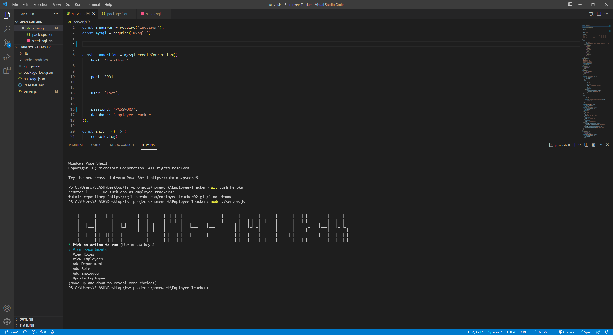

## Employee Mangament System

An application used through the termial that allows you to keep track of various data from employees

!(https://youtu.be/Cq4f5d6YE_E)

## Table of contents

- [Description](#description)
- [Installation](#installation)
- [Usage](#usage)
- [Contributing](#contributing)
- [Tests](#tests)
- [license](#license)
- [Questions](#questions)

## Installation
node, MYSQL server, MYSQL workbench, inquirer

## Usage
management of employees

## Contributing

Max Wittner
## Tests

undefined
## license 
    
    [MIT](https://opensource.org/licenses/MIT)

## Questions

Email: maxwittner01@gmail.com
Github: https://www.github.com/lilslash

    